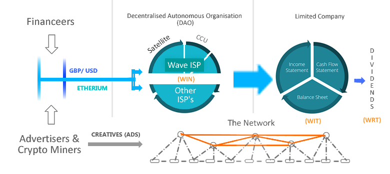

Introduction
~~~~~~~~~~~~~~

This document details the Eherieum-based, cryptocurrency Tokens and/or Coins generated by Wave®. 
Enclosed in this report is key data concerning Wave® cryptocurrency. 

There are 3 types of cryptocurrency used with Wave®: 

 - Wave® Impact Notes™ (WIN): Subscription-based account (min deposit £50 GBP per month). (22.5% APR)
 - Wave® Royalty Tokens™ (WRT): Receive a proportionate share of the revenue generated from the Wave® network. (16.6%+ APR)  
 - Wave® Interest Tokens™ (WIT): Gain annual interest. (10% APR) 

Unlike most companies, Wave® simultaniously operates its own bespoke and internal cryptocurrency banking system and services.
This new trend in tech business financials is most commonly refered to as a Decentralised Autonomous Organisation (DAO).
To fully understand this report, readers are advised to briefly research DAO's online before proceeding.

The Wave® DAO is able to re-write this financial report each time a transaction occcurs in order it remains concurrent.  
Furthermore, it will autonomously summarise these changes and place a link to the previous report in the changelog (of the latest report). 

The Wave® DAO even replaces written and signed legal agreements with encoded scripts known as cryptocurrency smart contracts.
This is essential for when our product must indentify, contracts-with and pay our customers Internet Service Provider's (ISP's), which it does fully autonomously.
Unique cryptographic addresses are also used to replace government issued identities to eliminate fraud and corruption.
Wave® also makes redundant conventional company shares (and promissory notes and interest payments to lenders) by issuing cryptographic 'Royalty' and 'Interest' Tokens. 

Traditionally the asset (Wave®) would be owned by the company, and shares in the company would determine ownership. 
In the case of Wave® a form of cryptocurrency we call 'Wave® Royalty Tokens (WRT)' are issued in place of shares and can be stored on the beneficiaries mobile phones (if they so desire) on free cryptocurrency wallets which are downloadble from the Wave®  website: makeitwave.com. 

True ownership of this organisations core asset is subsequently determined by whomever holds these Tokens, making shares in the company, for the best part, redundant.  
The DAO is effectively affording the company the privelage of being able to administrate it, subject to preset conditions and rules e.g. the company must hold the most Royalty Tokens.

The initial sale of these Tokens is a process called Initial Coin Offering (ICO). 
Details of the performance of the Tokens ICO's can be located under the Master Registers within this document.

Review & Purchase
####################

The Wave® DAO activity will appear on the Ethereum blockchain for `public record <https://ethereum.org>`__. 
To purchase Wave® Tokens please visit the investment section of our website: makeitwave.com

