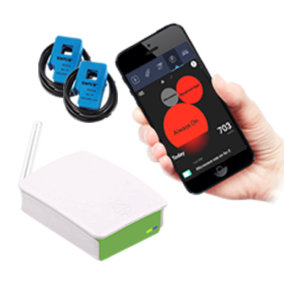

Wave® Product User Guide
=====================================================

*Wave® Energy Monitor™*

.. toctree::
   :maxdepth: 2
   
   releasenotes
   legalandsafety
   introduction
   thisproduct
   serviceandsupport
   warranty
   
   
  

**Document Author(s):** 
^^^^^^^^^^^^^^^^^^^^^^^^^

=====================
Siôn H. Buckler
=====================

+-------------------------------------+-------------------------------------+---------------------------------------------------------------------------------------+
|               Organisation          |              Role                   |                 Details                                                               |
+=====================================+=====================================+=======================================================================================+
| .. image:: images/wave-logo.png     |            Founder & CEO            | Make it Wave Ltd, British Corporation (England & Wales), ID 11363386, Company Director|
+-------------------------------------+-------------------------------------+---------------------------------------------------------------------------------------+
| .. image:: images/ccu.png           |            Head of Defence          | Caribbean Communications Unit (CCU), Royal Corps of Signals, Life Member ID 55983     |
+-------------------------------------+-------------------------------------+---------------------------------------------------------------------------------------+
| .. image:: images/uarsociety1.png   |               Secretary General	            | Utilities as Rights (UaR) Society, British Crown Public Servant, Gov/Oath ID 25148537 |
+-------------------------------------+-------------------------------------+---------------------------------------------------------------------------------------+
| .. image:: images/scottishbay.png   |      Entrepreneur in Residence      | Scottish Bay, Dominican Republic                                                      |
+-------------------------------------+-------------------------------------+---------------------------------------------------------------------------------------+

 

**About Siôn Buckler** - Science & Computer Science (Bachelors), Electronic Engineering, Industrial Electronics and Electronics & Computing (Advanced Diplomas), Cisco Certified Network Associate (CCNA), Microsoft Certified Solutions Expert (MCSE), Certified Project Management (Prince2 Practitioner), Institute of Electronic Engineering (IEEE), Siemens Certified Engineer, Certified Telecommunications Service Provider (NVQ3), Satellites & Full Spectrum Radio, Fixed Telecommunications Systems with Enhanced Capabilities (Nortel Passport, RAD-IP Mux, Probot Fiber Optics, APC Power Supplies), SKP01 Electrical Safety, NVQ2 IT, Defence Specialist LAN, TCP/IP, Subnetting, DHCP, Addressing, Routing & Browsing, Communications Equitment Room Design & Maintenance, Health & Fire Safety Officer, Military Command & Leader (Level 2 CMI),  Cyber Security (Pen Testing/ JOCS), Electronic Warfare, SIP/ VOIP, Google Advertising Professional, SEO, PPC, HTML5, CSS3, Java, Perl, Ajax, JQuery, MySQL, Unix, Python, Linux. 
 
