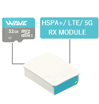

Wave® Home Hub™ - Freer Energy & Internet
=====================================================

Product User Guide
--------------------------------

.. toctree::
   :maxdepth: 1
   
   releasenotes
   legalandsafety
   introduction
   thisproduct
   serviceandsupport
   warranty
   

 
   
........................................
  

**Document Author:** Sion Hywel Buckler

........................................

Science & Computer Science (Bachelors), Electronic Engineering, Industrial Electronics and Electronics & Computing (Advanced Diplomas), Cisco Certified (CCNA), Microsoft Security Expert, Prince2, Institute of Electronic Engineering (IEEE), Siemens Certified Engineer, Certified Telecommunications Service Provider (NVQ3), Satellites & Full Spectrum Radio, Fixed Telecommunications Systems with Enhanced Capabilities (Nortel Passport, RAD-IP Mux, Probot Fiber Optics, APC Power Supplies), SKP01 Electrical Safety, NVQ2 IT, Defence Specialist LAN, TCP/IP, Subnetting, DHCP, Addressing, Routing & Browsing, Communications Equitment Room Design & Maintenance, Health & Safety, Fire Safety Officer, Cyber Warfare (Pen Testing/ JOCS), Electronic Warfare, SIP/ VOIP, Google Advertising Professional, SEO, PPC, HTML5, CSS3, Java, Perl, Ajax, JQuery, MySQL, Unix, Python, Linux. 

.. list-table:: 
   :widths: 50 50
   :header-rows: 0

   * - **Founder & CEO**   
     - .. image:: images/wave-logo.png 

	 
Make it Wave Ltd - Private Company 11363386. Limited by Shares, Registered Offices in England and Wales.

	 

.. list-table:: 
   :widths: 50 50
   :header-rows: 0
 
   * - **Head of Defence**
     - .. image::	images/ccu.png

Caribbean Communications Unit (CCU). Royal Signals Association Life Membership ID:55983

.. list-table:: 
   :widths: 50 50
   :header-rows: 0

   * - **Prime Technocrat**  
     - .. image::	images/scottishbay.png    
      

	 
Public Servant. Scottish Bay DAO. British Crown/ Oath ID: 25148537 (2002 - 2024)

