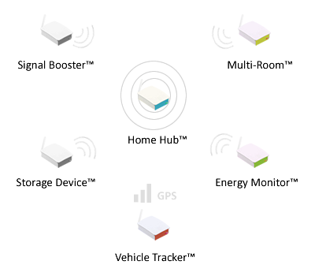
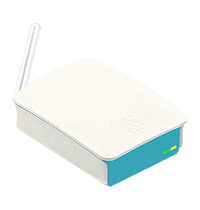

Introduction
=============

The topics described within most sections of this document apply to Wave's entire product line. For guidance on the specific product named in the title of this document, please refer to the 'About this Product' section.  

Wave® is a **Complete, All-in-One, Smart Home Solution**. Capabilities are **state of the art** and truely extrodinary: 

-  Multi-Room Media (DLNA - Music, Movies & IPTV Streaming)
-  Wireless Home Control (IoT, Smart Plug Sockets, Lights etc)
-  IP Camera Monitoring (DVR, Motion Detect & +50 IP Cameras)
-  Energy Monitoring (Self-Labelling & Deep Analysis of Energy Consumption)
-  Vehicle Tracking (USSD/ Non-Subscription & Carrier Free)

Wave® works right out of the box and is very different and far superior to other smart home solutions due to its abilities to reduce a homes energy and internet bills each month. 

The Wave® Smart Home
~~~~~~~~~~~~~~~~~~~~~~~~~~~~~~~~~~~~~~~~~~~~~~~~~~~~~~~~ 

Image 1.0 - Wave® Smart Home™

A Wave® Smart Home is a term which can be used to describe a home using (at the very least) a Wave® Home Hub™;

Image 1.1 - Wave® Home Hub™

**Key Factors about the Home Hub™:** 

	• Primarily a Wi-Fi Hotspot
	• Connects to existing Internet Router (ethernet port & cable) 
	• Works independantly or with enhancement products and/or accessories
	• Functions most effectively when all wireless devices connect exclusively to the Wave® Wi-Fi Hotspot
	• Not designed to replace or function as a replacement internet router/ modem

	
The Wave® Smart Home solution reduces a households energy bills each month by providing users a better way to manage user energy which reduces overal consumption. The Technology also reduces a households internet bills each month by contributing to the cost of internet by paying the users ISP directly (and automatically). 

**The Home Hub™** experience can be improved even further by introducing other Wave® products, known as **Home Hub™ Enhancement Products**. The quantity and configuration of these enhancement products will depend on the size of the users home, occupants and their personal preferences. Below is a list of the full range of Wave® Home Hub™ Enhacement Products: 

.. csv-table:: Table 1.0 - Wave's 'Enhacement' Products
   :file: table-data/enhancementproducts.csv
   :widths: 20, 80
   :header-rows: 1
   
   
**NOTES:**
	• The products above are to enhance the  `Wave® Home Hub™ <../../../../products/homehub/build/html/index.html>`__,  experience and do not function independantly. Please ensure you have a  `Wave® Home Hub™ <../../../../products/homehub/build/html/index.html>`__, in place, for these devices to communicate to. 

Dashboard & Tabs
------------------

  
Physical Description
~~~~~~~~~~~~~~~~~~~~~~~~~~~~~~~~~~~~~~~~~~~~~~~~~~~~

Hardware Features
------------------

Powering Up
------------------

Factory Reset
------------------

Power/Activity LED
---------------------

Handling Precaution
-------------------

**Safe Power Down & Disconnect**

**General Maintenance & Care**

Getting Started
~~~~~~~~~~~~~~~~~~~~~~~~~~~~~~~~~~~~~~~~~~~~~~~~~~~~

Accessing the devices menu 
----------------------------

Selecting Edition/ Completing Initial Installation 
-----------------------------------------------------

